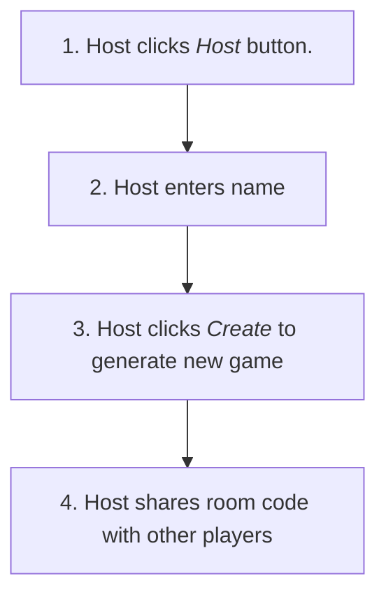

# Max Trivia

This is a timed trivia game. 

This is a general overview of the app and how to play. To learn how it interacts with the server, check out the [trivia-server](https://github.com/TheOmnimax/trivia-server) repository. 

## How to play

### New game.

1. Host clicks *Host* button.
2. Host enters name
3. Host clicks *Create* to generate new game
4. Host shares room code with other players
5. Other players click *Join*.
6. Other players enter their name and the room code, and click *Join*.
7. When everyone has joined the game, host clicks 

It is started by a host, and then guests can join the game. When the game starts,  everyone will see the question at the same time. Whomever answers the questions correctly first will win that round. 