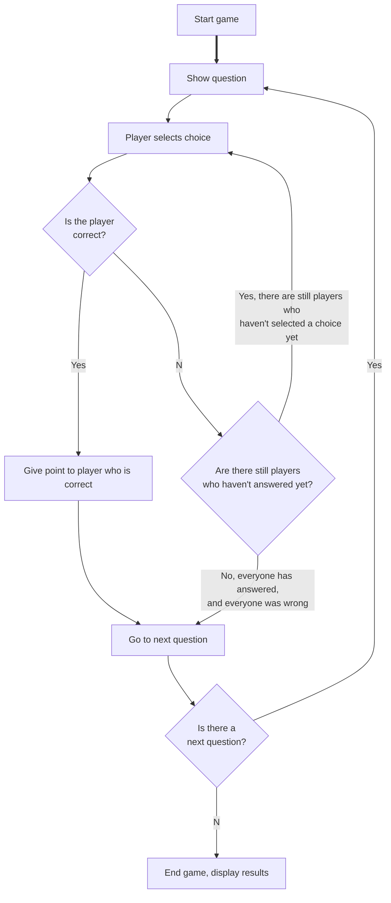

# Max Trivia

This is a timed trivia game. 

This is a general overview of the app and how to play. To learn how it interacts with the server, check out the [trivia-server](https://github.com/TheOmnimax/trivia-server) repository. 

## How to play

The game is started by a host, and then guests can join the game. When the game starts,  everyone will see the question at the same time. Whomever answers the questions correctly first will win that round.

### New game

Here is how to start a new game:

1. Host clicks *Host* button.
2. Host enters name
3. Host clicks *Create* to generate new game
4. Host shares room code with other players
5. Other players click *Join*.
6. Other players enter their name and the room code, and click *Join*.
7. When everyone has joined the game, host clicks *Start*, and the game will start.

As players join the game, their names will be displayed for all players, so the host can make sure everyone has joined successfully.

### Play game

Here is how the game will work when playing:

## Answering a question

When a player answers a question, it will show their choice in light green, and tell them to wait. When the round is over (either because a player selected the right choice, or everyone selected the wrong choice). Depending on the result, the player will get a different message, and a different color:

* If they are correct, and they are the first player to select the correct choice, then they win the round, and the choice will turn green with a checkmark.
* If they were correct, but another player was faster, then the choice will turn pale green, with no checkmark.
* If they were wrong, the choice they selected will turn red, and the correct choice will turn green.
* If they did not select a choice, the correct choice will turn gray.

## End game

When the game is over, it will display the results, including all scores, and the winner (or winners if there was a tie for first).

If there was no winner, it will not display the scores, since everyone got 0 points.