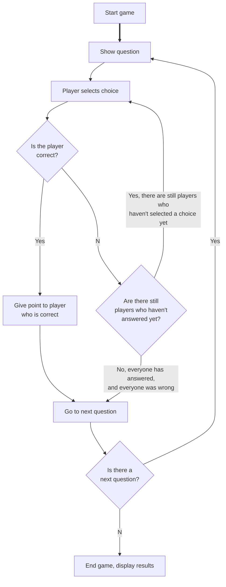

# Flowchart of play

Here is how the game will work when playing:

```mermaid
flowchart TD

start[Start game] ==> dispQuestion[Show question]

dispQuestion --> playerSelect[Player selects choice]
playerSelect --> isCorrect{Is the player\ncorrect?}

isCorrect --Yes--> playerCorrect[Give point to player\nwho is correct]
isCorrect --No--> morePlayers{Are there still\nplayers who haven't\nanswered yet?}

playerCorrect --> nextQuestion[Go to next question]
nextQuestion --> isNext{Is there a\nnext question?}

morePlayers --Yes, there are still players who\nhaven't selected a choice yet--> playerSelect
morePlayers --No, everyone has answered,\nand everyone was wrong--> nextQuestion

isNext --Yes--> dispQuestion
isNext --No--> endGame[End game, display results]
```